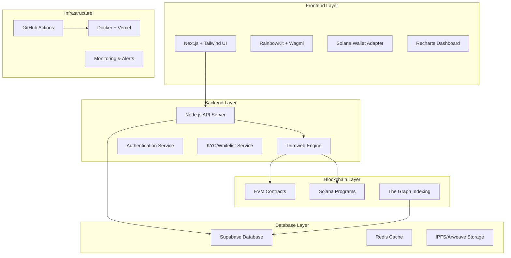

# 🏗️ NoblePad Launchpad - Global Architecture

## 🎯 **Mission Statement**
Build a complete, professional, and secure multi-chain crypto Launchpad that supports both Solana and EVM chains with enterprise-grade security and user experience.

## 🏛️ **System Architecture Overview**



## 🎭 **Agent Specializations**

### 1. **🏗️ Architect Agent**
- **Role**: System design and coordination
- **Responsibilities**:
  - Database schema design
  - API route planning
  - Smart contract architecture
  - Integration patterns
  - Security requirements

### 2. **⛓️ Smart Contract Agent**
- **Role**: Blockchain development
- **Responsibilities**:
  - EVM contracts (Hardhat + Foundry)
  - Solana programs
  - Thirdweb integration
  - Security auditing (Slither, Mythril, GPTScan)
  - Gas optimization

### 3. **🎨 Frontend Agent**
- **Role**: User interface development
- **Responsibilities**:
  - Next.js application
  - Wallet integrations
  - Dashboard components
  - Charts and analytics
  - Responsive design

### 4. **🔧 Backend Agent**
- **Role**: API and service development
- **Responsibilities**:
  - Node.js API server
  - Database operations
  - KYC/Whitelist services
  - Webhook handlers
  - Rate limiting

### 5. **🛡️ Security Agent**
- **Role**: Security and auditing
- **Responsibilities**:
  - Contract auditing
  - API security testing
  - Vulnerability scanning
  - Security documentation
  - Penetration testing

### 6. **🚀 Deployment Agent**
- **Role**: DevOps and deployment
- **Responsibilities**:
  - Docker containerization
  - CI/CD pipelines
  - Infrastructure setup
  - Monitoring and alerts
  - Environment management

## 📊 **Technology Stack**

### **Frontend**
- **Framework**: Next.js 14 (App Router)
- **Styling**: Tailwind CSS + HeadlessUI
- **EVM Wallets**: RainbowKit + Wagmi
- **Solana Wallets**: Solana Wallet Adapter
- **Charts**: Recharts
- **State**: Zustand
- **Forms**: React Hook Form + Zod

### **Backend**
- **Runtime**: Node.js 18+
- **Framework**: Express.js
- **Database**: Supabase (PostgreSQL)
- **Cache**: Redis
- **Authentication**: JWT + Supabase Auth
- **File Storage**: IPFS + Arweave

### **Blockchain**
- **EVM Development**: Hardhat + Foundry
- **Solana Development**: Anchor Framework
- **Web3 SDK**: Thirdweb SDK
- **RPC Providers**: Alchemy + Moralis
- **Indexing**: The Graph Protocol

### **Security**
- **Contract Auditing**: Slither, Mythril, GPTScan
- **API Security**: Helmet.js, Rate Limiting
- **Environment**: Dotenv, Secrets Management
- **Monitoring**: Sentry, DataDog

### **DevOps**
- **Containerization**: Docker + Docker Compose
- **CI/CD**: GitHub Actions
- **Frontend Hosting**: Vercel
- **Backend Hosting**: Railway / Render
- **Domain**: Custom domain with SSL

## 🗂️ **Project Structure**

```
noblepad-launchpad/
├── packages/
│   ├── contracts/              # Smart contracts
│   │   ├── evm/               # EVM contracts (Hardhat)
│   │   ├── solana/            # Solana programs (Anchor)
│   │   └── shared/            # Shared contract utilities
│   ├── frontend/              # Next.js application
│   │   ├── src/
│   │   ├── public/
│   │   └── package.json
│   ├── backend/               # Node.js API
│   │   ├── src/
│   │   ├── docker/
│   │   └── package.json
│   ├── indexer/               # The Graph indexer
│   │   ├── subgraphs/
│   │   └── schemas/
│   └── shared/                # Shared utilities
│       ├── types/
│       ├── constants/
│       └── utils/
├── docs/                      # Documentation
├── scripts/                   # Deployment scripts
├── docker-compose.yml         # Local development
├── .github/                   # CI/CD workflows
└── README.md
```

## 🔄 **Development Workflow**

### **Phase 1: Foundation** (Week 1)
1. **Architect Agent**: Design database schema and API routes
2. **Smart Contract Agent**: Create core contracts
3. **Frontend Agent**: Setup Next.js with wallet connections
4. **Backend Agent**: Create API server structure
5. **Security Agent**: Setup security testing framework
6. **Deployment Agent**: Create Docker setup

### **Phase 2: Core Features** (Week 2)
1. **Token Creation**: EVM + Solana token factories
2. **Presale System**: Complete presale contracts and UI
3. **Wallet Integration**: Multi-chain wallet support
4. **Admin Dashboard**: Project management interface
5. **Database Integration**: Complete CRUD operations

### **Phase 3: Advanced Features** (Week 3)
1. **Liquidity Locks**: Automated LP token locking
2. **Vesting Schedules**: Time-based token releases
3. **KYC System**: Identity verification
4. **Analytics Dashboard**: Charts and metrics
5. **Mobile Optimization**: Responsive design

### **Phase 4: Security & Launch** (Week 4)
1. **Security Audits**: Complete contract and API auditing
2. **Performance Optimization**: Gas optimization and caching
3. **Documentation**: Complete user and developer docs
4. **Testnet Deployment**: Full system testing
5. **Production Deployment**: Live system launch

## 🛡️ **Security Requirements**

### **Smart Contract Security**
- ✅ Reentrancy protection
- ✅ Integer overflow protection
- ✅ Access control mechanisms
- ✅ Emergency pause functionality
- ✅ Time lock mechanisms
- ✅ Multi-signature requirements

### **API Security**
- ✅ Rate limiting
- ✅ Input validation
- ✅ SQL injection protection
- ✅ XSS prevention
- ✅ CORS configuration
- ✅ Authentication & authorization

### **Infrastructure Security**
- ✅ SSL/TLS encryption
- ✅ Environment variable security
- ✅ Database encryption
- ✅ API key rotation
- ✅ Monitoring and alerting
- ✅ Backup and recovery

## 📈 **Success Metrics**

### **Technical Metrics**
- 🎯 **Performance**: <2s page load times
- 🎯 **Uptime**: 99.9% availability
- 🎯 **Security**: Zero critical vulnerabilities
- 🎯 **Gas Efficiency**: <50k gas for token creation
- 🎯 **Mobile Support**: Perfect mobile experience

### **Business Metrics**
- 🎯 **User Experience**: Intuitive one-click operations
- 🎯 **Multi-chain**: Seamless chain switching
- 🎯 **Scalability**: Support 1000+ concurrent users
- 🎯 **Compliance**: Full KYC/AML compliance
- 🎯 **Documentation**: Complete developer guides

## 🚀 **Next Steps**

The team of agents will now collaborate to build this complete system. Each agent will:

1. **Receive their specific briefing** and requirements
2. **Build their components** autonomously
3. **Coordinate with other agents** for integration
4. **Test their implementations** thoroughly
5. **Deploy and monitor** their systems

Let's build the most advanced crypto launchpad ever created! 🌟